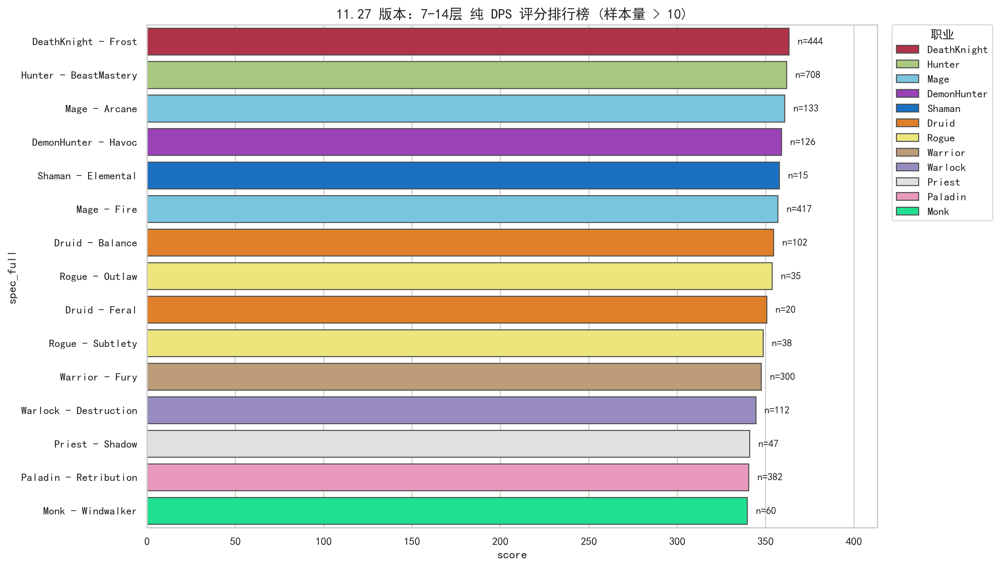
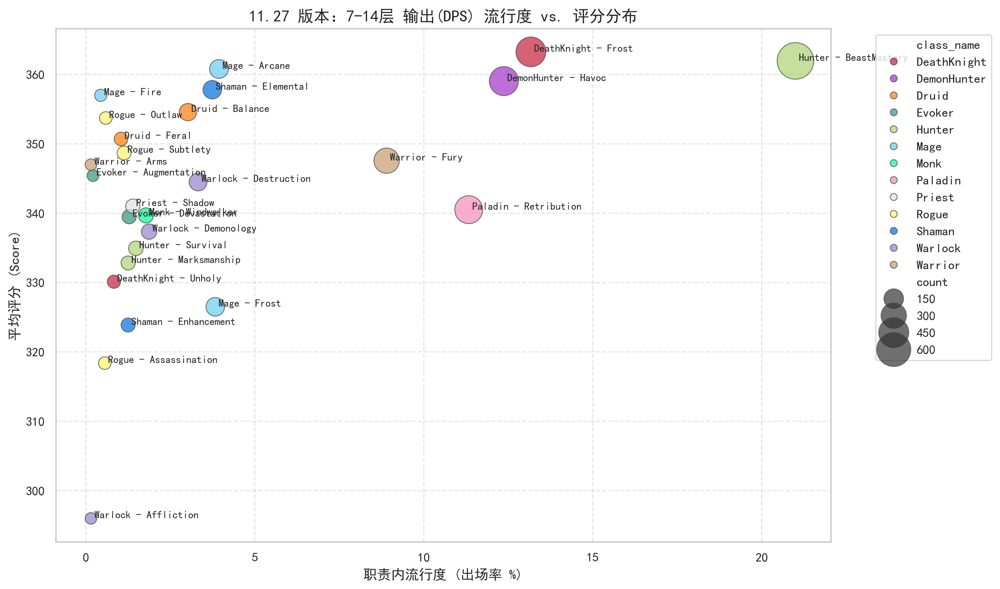
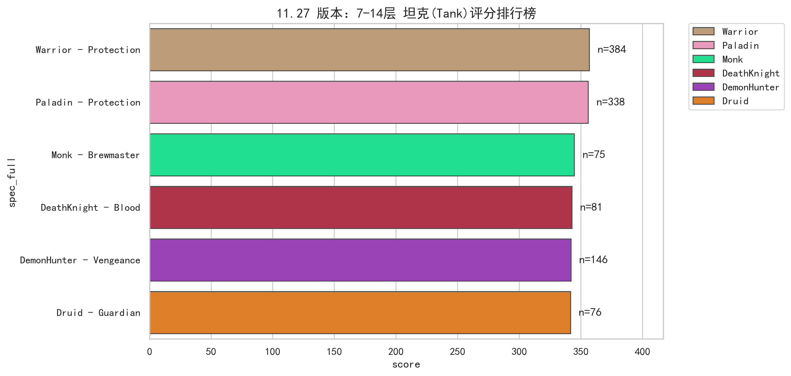
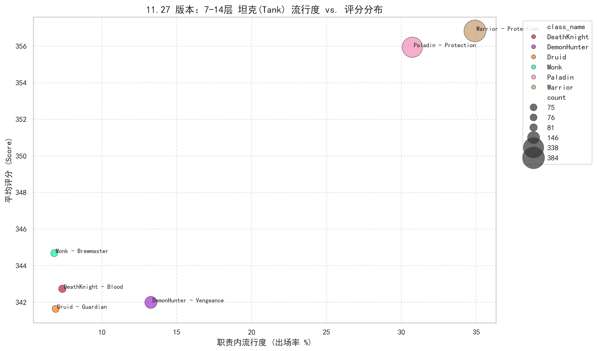
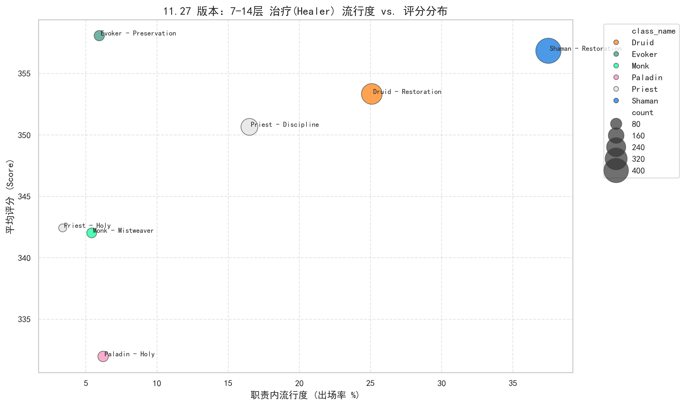

# WoW Mythic+ Class Performance Analysis (Patch 11.27)
### 《魔兽世界》11.27 版本普通玩家大秘境职业强度分析

Data analysis of Mythic+ class performance for average players (keys 7–14) in WoW patch 11.27 using Warcraft Logs data.

---

## 1. Project Overview / 项目概述
This project analyzes class and specialization performance in World of Warcraft Mythic+ dungeons for **average players**, focusing on keystone levels **7–14** in patch **11.27**.
Using data from **Warcraft Logs (WCL)**, the goal is to evaluate real-world class strength under controlled difficulty and item level conditions.

---

## 4. Key Insights & Conclusion / 核心洞察与结论

### 4.1 Role-Specific Analysis / 职责深度剖析

#### 🟢 输出赛道 (DPS): Frost DK & Fire Mage
* **Frost Death Knight**: The "numerical gold standard" ($n=444$).
* **Fire Mage**: High-tier scores despite low popularity, suggesting **"Survivor Bias"**.




#### 🔵 坦克赛道 (Tank): Popularity vs. Fragility
* **Protection Warrior**: Most reliable choice for average players.
* **Protection Paladin**: **"Deceptive popularity"** ($n=338$). It is significantly **"squishier"** than Warriors.




#### 🔴 治疗赛道 (Healer): The Shaman Monopoly
* **Restoration Shaman**: Dominates with nearly 40% popularity.
* **Preservation Evoker**: The "hidden gem" with the highest ceiling.




---

## 5. Repository Structure / 仓库结构
```text
├── data/
│   └── processed/          # Cleaned dataset
├── figures/                # Exported analysis charts
├── notebooks/              # Data analysis logic
└── README.md
```
---

## 6. Analysis Pipeline / 分析流程
1. **Data collection**: Extracting raw battle logs via Warcraft Logs API.
2. **Data cleaning**: Stratifying data by item level and filtering for keystone levels 7–14.
3. **Role Sharding**: Segregating data into DPS, Tank, and Healer subsets to ensure intra-role fairness.
4. **Visualization**: Generating distribution plots and popularity-score quadrants to identify Meta outliers.

1. **数据采集**：通过 Warcraft Logs API 提取原始战斗日志。
2. **数据清洗**：按装等分层并筛选 7–14 层核心数据。
3. **职责分流**：将数据切分为输出、坦克、治疗子集，确保职责内部对比的公平性。
4. **可视化分析**：生成表现分布图与流行度-评分象限图，识别版本强势与异常职业。
